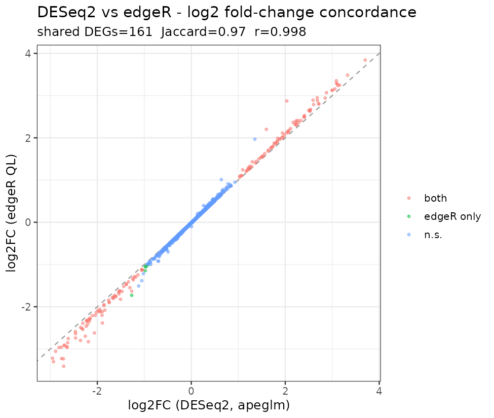
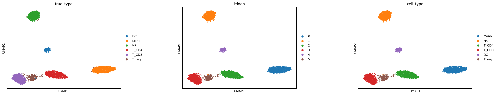
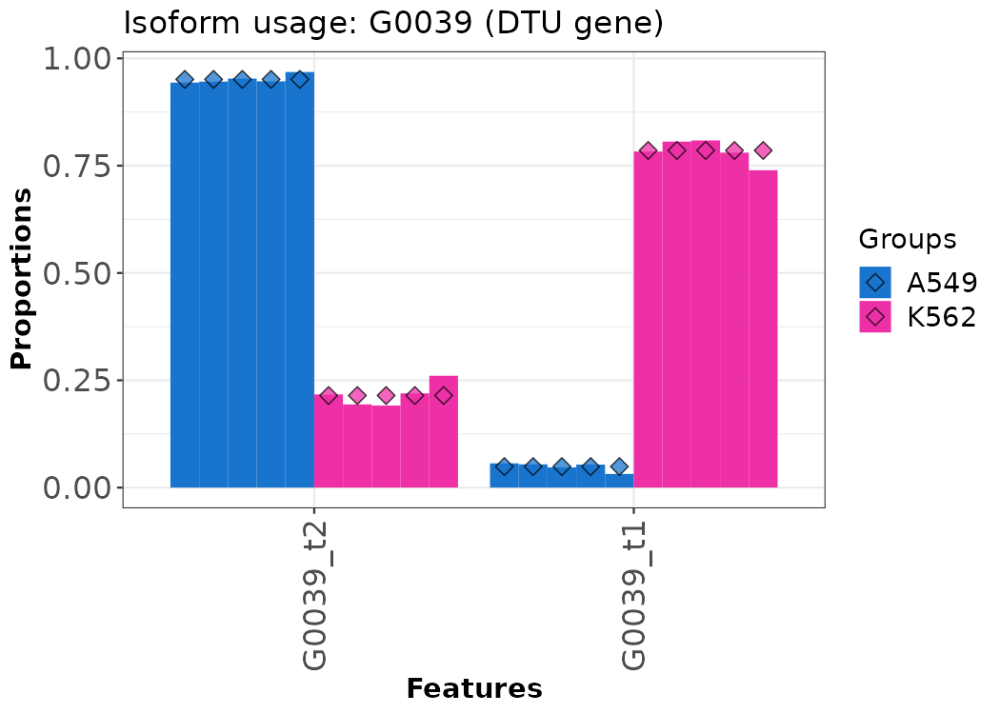

# Transcriptomics analysis suite: bulk RNA-seq, single-cell, and long-read isoforms

Three RNA-seq pipelines in one repo. Bulk differential expression in R, single-cell clustering and annotation in Python, and Nanopore long-read isoform usage. Each one runs through a reproducible workflow, and each one is checked against a dataset where the right answer is already known, so the numbers below can be regenerated with one command.

`make validate` re-runs every check. A GitHub Actions workflow is set up to do the same on each push.

## What's here

Three arms, built to run on a 16 GB laptop and scale up from there.

**Bulk RNA-seq (Arm 1, R).** Salmon or STAR for quantification, then differential expression with DESeq2 and edgeR on the same counts, then GO/KEGG/GSEA. Running two DE tools and comparing them is the point: it catches results that depend on which tool you happened to pick.



On simulated data with 200 planted differentially-expressed genes, it hits precision 0.98 and recall 0.92 with every fold-change sign correct. The two tools agree closely (Jaccard 0.97, log2 fold-change correlation 0.998).

**Single-cell RNA-seq (Arm 2, Python).** A Scanpy pipeline: QC, doublet removal with Scrublet, PCA, Leiden clustering, UMAP, and marker-based annotation. A short Seurat v5 script runs the same steps in R so the two can be compared.



On 3,500 simulated cells across six labelled cell types, clustering matches the true labels at ARI 0.99 with annotation accuracy 0.99.

**Long-read isoforms (Arm 3, R).** minimap2 for spliced alignment, Bambu or IsoQuant for transcript discovery and quantification, then differential transcript usage with DRIMSeq and stageR. This asks whether the mix of isoforms shifts between conditions, which is the question long reads answer well and short reads usually can't.



On 800 genes with 120 planted isoform switches, it recovers them at precision 0.91 and recall 0.97.

## Reproducing the numbers

`make validate` simulates each dataset, runs the actual pipeline code against it (not a separate copy), scores the output against the known truth, and writes VALIDATION.md. All three arms pass. Doing it this way means anyone can check the claims, including me six months from now.

| Arm | Checked against | Result |
|-----|-----------------|--------|
| Bulk DE | 200 planted DE genes | precision 0.98, recall 0.92, signs 100% correct |
| Single-cell | 6 labelled cell types | ARI 0.99, accuracy 0.99 |
| Long-read DTU | 120 planted isoform switches | precision 0.91, recall 0.97 |

## Running it on real data

The pipelines are set up for SG-NEx (matched Illumina and Nanopore) and 10x PBMC. Those hosts aren't always reachable, so `make real-example` runs the same code on real public data instead: a fission-yeast RNA-seq experiment pulled from GitHub, and a real 10x PBMC set that ships inside Scanpy.

The difference between simulated and real is worth being straight about. On the yeast data, DESeq2 and edgeR still track each other (fold-change correlation 0.93 on the wild-type stress contrast). The single-cell run scores ARI 0.40 against the published labels, well under the 0.99 on simulated cells, because real immune cells don't separate as cleanly as planted ones. The broad lineages come out clearly (B cells, monocytes, dendritic cells), while the fine T-cell subsets blur into each other. The simulation shows the code is correct. The real data shows what you actually get. RESULTS.md has the full write-up.

## Quickstart

```bash
make envs           # three conda environments, one per arm
make validate       # the ground-truth checks, no downloads needed
make real-example   # real public data, start to finish

# full run on a machine with network access:
conda activate p2-bulk && make refs
bash scripts/download_sgnex.sh && bash scripts/download_pbmc.sh
make bulk longread sc
```

## Layout

```
environments/    three pinned conda environments
config/          config.yaml and the sample sheet
scripts/         data download, reference prep, subsampling
arm1_bulk/       Salmon/STAR, DESeq2 + edgeR, GO/KEGG/GSEA   (Snakemake)
arm2_singlecell/ Scanpy pipeline and notebook, Seurat script
arm3_longread/   minimap2, Bambu/IsoQuant, DTU               (Snakemake)
tests/           the validators behind make validate
real_example/    the real-data run described above
nfcore_demo/     nf-core/rnaseq on its test profile
```

## Tools

Snakemake and conda for the workflow. R with DESeq2, edgeR, tximport, clusterProfiler, Bambu, DRIMSeq, and stageR. Python with Scanpy, anndata, leidenalg, and Scrublet. Seurat v5 for the single-cell cross-check, nf-core/rnaseq as a reference workflow, and GitHub Actions for the validation run.

## Notes

STAR runs on chromosomes 20 to 22 and reads are downsampled, which keeps the whole thing laptop-sized. Both are config settings; change them and the pipelines run genome-wide at full depth. The SG-NEx download and the long-read run need a machine with network access and conda. That part is wired up but hasn't been run here.

Licensed under MIT.