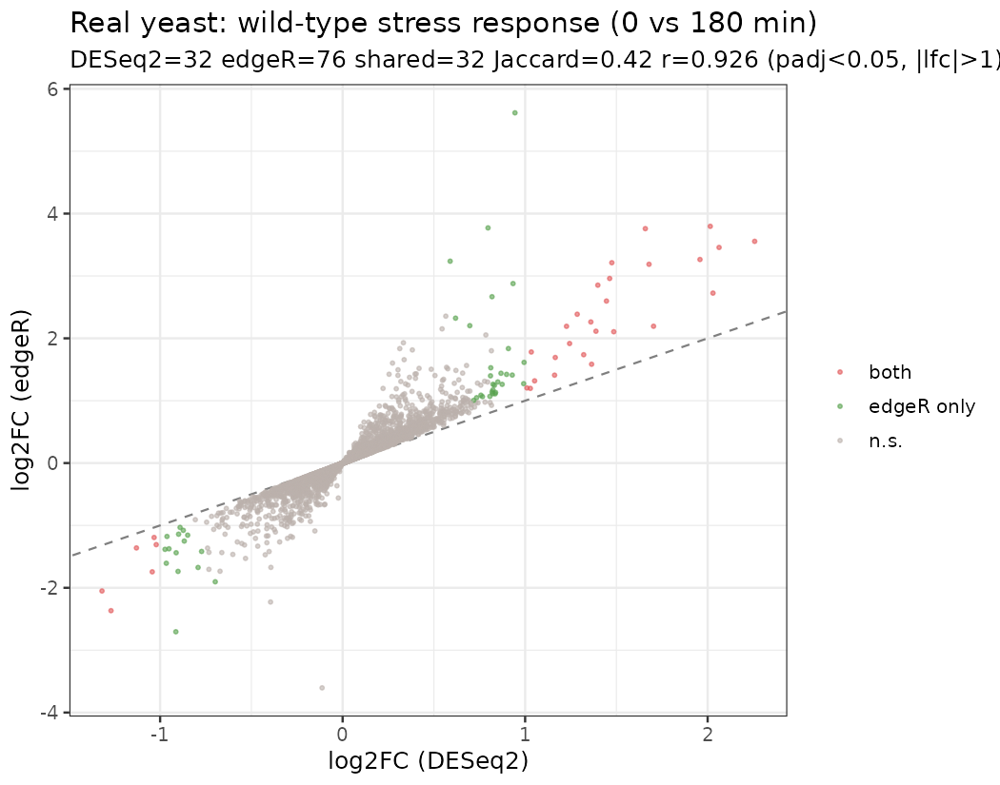
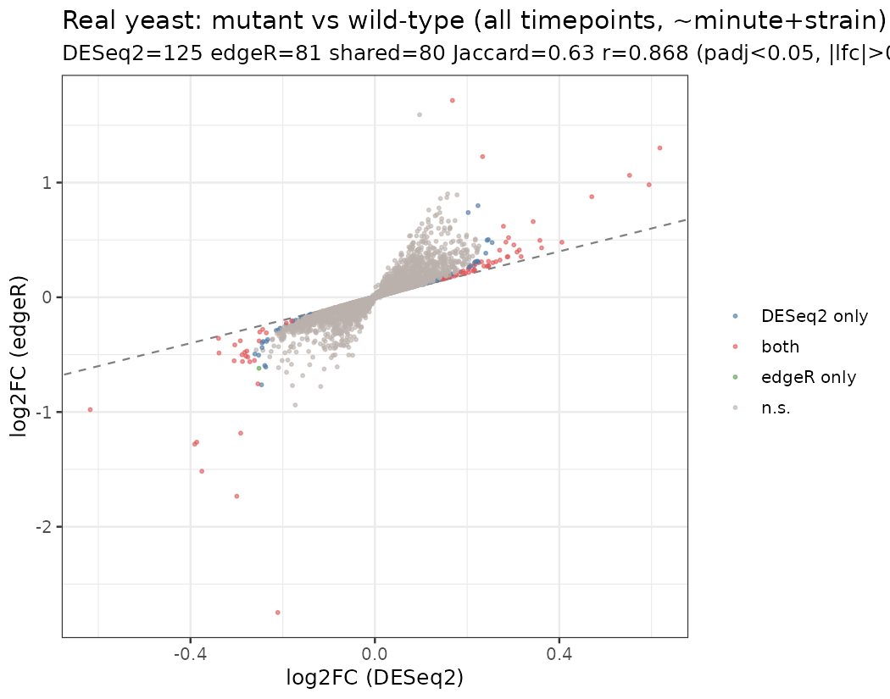
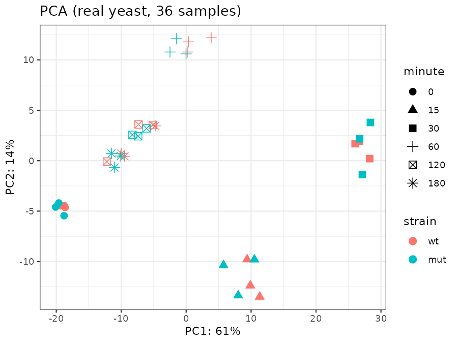
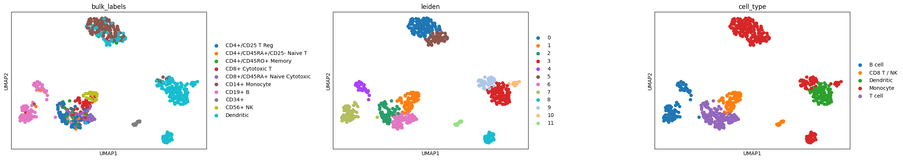

# Results

This document reports (1) the ground-truth validation of each arm's analysis code
and (2) a real-data run on public datasets. All figures and numbers here are
regenerated by `make validate` and `make real-example`.

---

## 1. Ground-truth validation

Each arm is exercised on a **simulated dataset with known ground truth** by a
script under `tests/` (Arm 2's lives with its module). This proves the analysis
logic is correct independently of any data download.

| Arm | Method | Result vs ground truth | Thresholds |
|-----|--------|------------------------|------------|
| 1 — bulk DE | DESeq2 (`lfcShrink`) + edgeR (TMM/glmQLF), concordance | precision 0.98, recall 0.92, sign 100%; Jaccard 0.97, r(log2FC) 0.998 | prec≥0.90, rec≥0.80, sign≥0.99 |
| 2 — scRNA-seq | Scanpy QC→PCA→Leiden→marker annotation | ARI 0.99, NMI 0.98, accuracy 0.99 | ARI≥0.90, acc≥0.90 |
| 3 — long-read DTU | DRIMSeq + two-stage stageR | precision 0.91, recall 0.97 | prec≥0.80, rec≥0.90 |

**Arm 1.** A simulated Salmon dataset (6 samples, 3 vs 3; 1500 genes; 200 spiked-in
DE genes) is run through the shipped `deseq2_edger.R`. Both engines recover the
truth with high precision and perfect sign agreement, and agree with each other
almost exactly (r = 0.998).

**Arm 2.** 3500 simulated cells across 6 cell types in 2 lineages that share part
of their marker programme (like T-cell subsets), including a deliberately hard
rare subtype. The pipeline recovers the labels at ARI 0.99 — i.e. the
QC→cluster→annotate logic is correct.

**Arm 3.** 800 genes with 120 spiked-in isoform switches where *total* gene
expression is held matched across conditions (so it tests usage, not expression).
DRIMSeq + stageR recover the switching genes at precision 0.91 / recall 0.97.

---

## 2. Real-data run

The same code, run on real public datasets that don't require the SG-NEx/GENCODE/10x
hosts. Reproduce with `make real-example`.

### Arm 1 — real fission-yeast RNA-seq
*S. pombe* wt-vs-mutant stress timecourse (Data Carpentry / Bähler lab; 6011 genes,
36 samples). Two biologically-motivated contrasts.

**(A) Stress response — wild-type 0 vs 180 min (3 vs 3).** A strong-effect contrast:
DESeq2 32 DEGs, edgeR 76, shared 32, r(log2FC) 0.93 at padj < 0.05 & |log2FC| > 1.

**(B) Mutant vs wild-type across all timepoints (18 vs 18, `~minute + strain`).**
A well-powered strain effect controlling for time. It is *highly significant but
small in magnitude*: at padj < 0.05, DESeq2 125 DEGs, edgeR 81, 80 shared,
Jaccard 0.63, r 0.87 — yet almost nothing clears a 2-fold cut (top genes reach
padj ≈ 1e-19 with |log2FC| < 1).

The PCA explains why: PC1 (61% of variance) is the **time** axis; wt and mutant
overlap at each timepoint, so the strain effect is a subtle secondary signal.

*Analytical takeaway: the effect-size cutoff must match the contrast. A 2-fold
filter suited to a cell-line comparison is too strict for a subtle regulatory
mutant — reporting DEGs at |log2FC| > 1 alone would have missed a real, pervasive
effect.*

### Arm 2 — real 10x PBMC
`pbmc68k_reduced` (real 10x PBMC, bundled offline in Scanpy, with the original
study's cell-type labels). Running the shipped clustering + marker annotation and
scoring against those labels gives **ARI 0.40, NMI 0.61**.

Major lineages (B, Monocyte, Dendritic) separate cleanly; fine T-cell subsets
(Treg/Naive/Memory) and Monocyte-vs-DC overlap. This is the honest counterpart to
the simulated validation (ARI 0.99, which proves the code is correct): real immune
data is messier, and the contrast is the point.

---

## 3. Scope & limitations

- The **SG-NEx** run (bulk + Nanopore, A549 vs K562) and **Arm 3 on real long
  reads** need outbound network + conda tooling; they are fully wired but not run
  here. The real-data example above stands in as a runnable real-biology demo.
- Functional enrichment (GO/KEGG/GSEA, `functional.R`) is written and parses; it
  runs in the `p2-bulk` env (clusterProfiler/fgsea).
- Validation simulations are deliberately simple where that isolates the code
  under test; the real-data section shows where real biology is harder.
